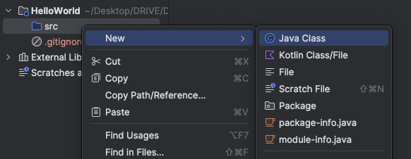

# Section 04 - IntelliJ Basics

- An IDE is the easiest, least error-prone way to develop, manage and deploy Java classes. It provides many benefits to developers, including

  - increased productivity,
  - code completion,
  - refactoring of code,
  - debugging tools,
  - version control,
  - and team development, just to name a few. And don't worry if you don't understand some of these terms, they will make sense as we progress through the course.

- The JDK is effectively a Software Development Kit, or SDK. Whatever you call it, it contains the tools you need, to write programs. The Java Development Kit, includes the tools that enables the computer to understand your java code, and to execute it. It also has a debugger.

## Naming items in Java

| identifier    | Usage          | Recommended | Example            |
| ------------- | -------------- | ----------- | ------------------ |
| Project Name  | IntelliJ Field | Pascal Case | `FirstJavaProject` |
| Class Name    | Java Element   | Pascal Case | `NewClass`         |
| Method Name   | Java Element   | Camel Case  | `getData`          |
| Variable Name | Java Element   | Camel Case  | `firstVariable`    |

## IntelliJ



## Hello, World!

```java
public class FirstClass {
    public static void main(String[] args) {
        System.out.print("Hello, World!");
    }
}
```

- `public` Java keyword is an access modifier
- `class` is used to define a class. `{...}` is used to denote the classs body. Classes have an optional access modifier. Within a class we have data, moethods etc
- A method is a collection of statements that performs a operation. `main` is a special Java method. It is the entry point for any Java code

## If

- Used for codtional logic

```java
public class Hello {
    public static void main(String[] args) {
        System.out.println("Hello, World!");

        boolean isAlien = false;
        if(isAlien == false) {
            System.out.println("It is not an alien!");
        }
    }
}
```

- Similar to other languages, if statements without a code block `{...}` will only treat the next line as under the if statement

## Other Operators

> [!IMPORTANT]
>
> - Logical AND (`&&`)
> - Logical OR (`||`)
> - Assignment (`=`)
> - Equals (`==`)
> - Conditional Operator (`? :`)
>
> You know about these!

- [Summary of Operators](https://docs.oracle.com/javase/tutorial/java/nutsandbolts/opsummary.html)
- [Java Operator Precedence Table](https://www.cs.bilkent.edu.tr/~guvenir/courses/CS101/op_precedence.html)

```java
public class Challenge {
    public static void main(String[] args) {
        double first = 20.0, second = 80.0;
        double third = (first + second) * 100;
        double fourth = third % 40.0;
        boolean isZero = fourth == 0.00;

        System.out.println(isZero);

        if(!isZero) {
            System.out.println("got some remainder!");
        }
    }
}
```
